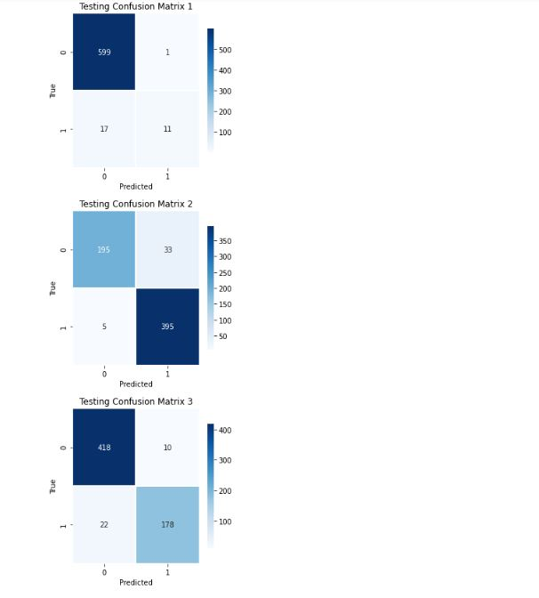
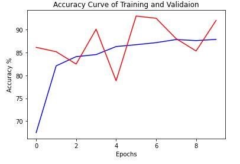
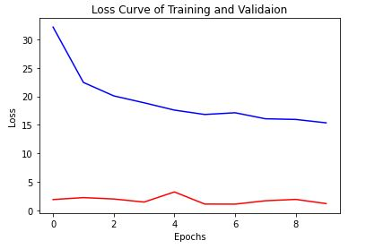
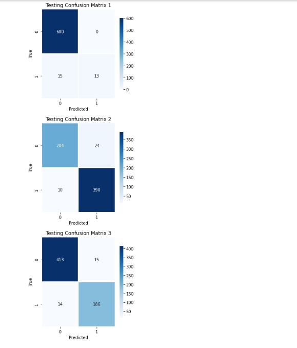
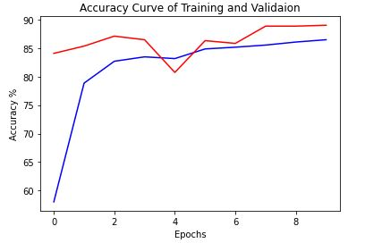
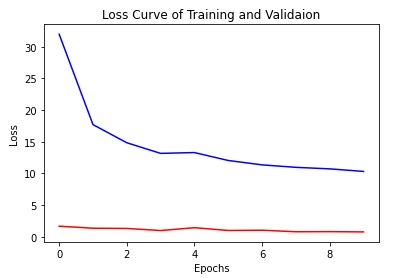
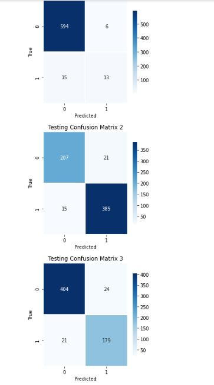
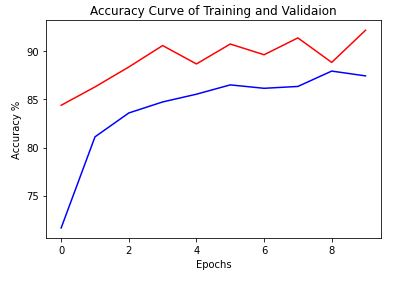
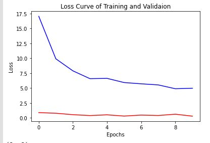

# BSCS16063_COVID19_DLSpring2020
This repository contains code and results for COVID-19 classification assignment by Deep Learning Spring 2020 course offered at Information Technology University, Lahore, Pakistan. This assignment is only for learning purposes and is not intended to be used for clinical purposes.

# Assignment 5 Part(B)

## Dataset
https://drive.google.com/file/d/1eytbwaLQBv12psV8I-aMkIli9N3bf8nO/view

#Weights Link
## VGG16 without Focal Loss
https://drive.google.com/file/d/1OgNtwGCArduZ0vUUIr2ZlRBsQsgzPmmT/view?usp=sharing

## Resnet18 without Focal Loss
https://drive.google.com/file/d/1YvFyNN9dAQNzoUpsnCSkcokS999uSciV/view?usp=sharing

## VGG16 with Focal Loss
https://drive.google.com/file/d/1-E8QXklXKrM9AOFZyj1BM3iQkytJqzcL/view?usp=sharing

## Resnet with Focal Loss
https://drive.google.com/file/d/1-3e_ULkXB8s48hsGdy7_w-82KijVXeVt/view?usp=sharing

# **Results Without Focal Loss**

## VGG16

**Accuracy**
Training Accuracy 86.66129032258064 %

Validation Accuracy 90.12738853503184 %

**Accuracy Curves**

(Blue for Training and Red for validation)

**Loss Curves**

(Blue for Training and Red for validation)

**F1 Score**
Validation F1 Score : 0.9140127388535032

**Validation Confusion Matrix**

# Resnet18

**Accuracy**
Training Accuracy 87.88709677419355 %
Validation Accuracy 92.03821656050955 %

**Accuracy Curves**

(Blue for Training and Red for validation)

**Loss Curves**

(Blue for Training and Red for validation)

**F1 Score**

Validation F1 Score : 0.9378980891719745

**Validation Confusion Matrices**

** Confusion Matrix**

# **Results with Focal Loss**

## VGG16

**Accuracy**

Training Accuracy 86.46774193548387 %

Validation Accuracy 89.01273885350318 %

**Accuracy Curves**

(Blue for Training and Red for validation)

**Loss Curves**

(Blue for Training and Red for validation)

**F1 Score**

Validation F1 Score : 0.9187898089171974

**Validation Confusion Matrices**
***Confusion Matrix***

## Resnet18

**Accuracy**
Training Accuracy 87.45161290322581 %
Validation Accuracy 92.19745222929936 %

**Accuracy Curves**

(Blue for Training and Red for validation)

**Loss Curves**

(Blue for Training and Red for validation)

**F1 Score**

Validation F1 Score : 0.9347133757961783

** ValidationConfusion Matrices**

**Confusion Matrix**

